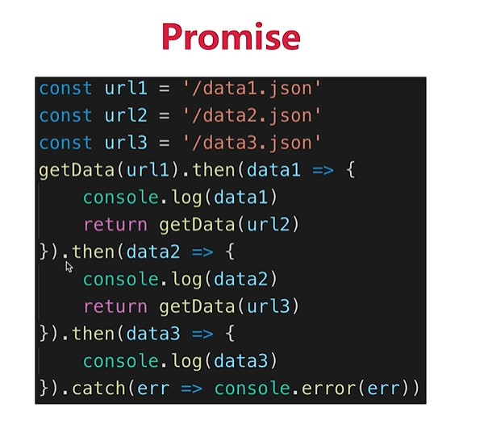

# 精讲

## 1. 基础部分

  1. 变量:用来存放数据,保存的数据可以修改

  2. 常量:用来存放数据,保存的数据不可修改

  3. 变量和常量的本质,无论是变量还是常量,其本身都是数据,也需要在内存中占用内存空间,保存在内存的栈结构分区中

  4. ECMAScript标准定义了8种数据类型
       1. 7种原始数据类型：String,Numbr,Boolean,Undefined,null,Symbol,BigInt

        2. Object
        5.  引用数据类型

  5. Object,Function,Array,Date,RegExp

  6. typeof 运算符(判断数据的类型)
     1. 作用:用来获取当前变量中存储的数据的类型
     1. 使用方式：`typeof 变量名`或`typeof(变量名)`
     2. typeof的返回值有多少个
        - String,Number,Boolean,Undefined,Object,Function
        - 特殊的有两个:null和array的结果都是Object

  7. instanceOf 运算符(原生JS判断实例的类型)

     1. 作用:用来判断当前实例对象是不是某种数据类型
     2. 用法：`对象 instanceOf 类型`

  8. 基本数据类型和引用数据类型在内存中,内存空间是如何存储数据的
     1. 除 Object 以外的所有类型都是不可变的（值本身无法被改变）,JavaScript 中字符串是不可变的（译注：如，JavaScript 中对字符串的操作一定返回了一个新字符串，原始字符串并没有被改变）。我们称这些类型的值为“原始值”。
     2. 基本数据类型的值在栈空间中存储,如果修改了数据,则是把原来的值直接干掉,重新存放新的值
     3. 引用数据类型的对象在堆空间中存储,该空间的地址在栈空间中存储,如果修改栈空间存储的地址,则指向发生变化,也叫引用发生了变化,此时是在堆空间中重新指向了一个新的内存空间(存储了一个新的对象)
     4. 基本类型之间的值如何传递? 传递的是数值
     5. 引用类型之间的值如何传递? 传递的是引用(地址)


     

  9. 内存:用于暂时存放CPU中的运算数据以及与硬盘等外部存储器交换的数据

     1. 计算机在运行中，CPU就会把需要运算的数据调到内存中进行运算，当运算完成后CPU再将结果传送出来，内存的运行也决定了计算机的稳定运行。
     2. 内存通电后产生的存储空间(临时的)
     3. 产生和死亡:内存条(集成电路板)--->通电--->产生一定的容量存储空间--->存储各种数据--->断电--->内存空间全部消失
     4. 内存的空间是临时的,而硬盘的空间是持久的
     5. 内存包含2个数据:内存存储的数据(一般数据/地址数据)和内存地址值数据
     6. 内存分类:
         - 栈结构: 全局变量，局部变量(空间较小)
         - 堆结构(列表结构): 对象 (空间较大) 

     

## 2. 对象

1. 具有一定的属性或者方法,特指的某个事物

2. 看得见或者是摸得到,特指的某个东西

3. 识别对象,抽象出对象有什么特征和行为

4. 抽象出当前的对象属于什么类别

5. 以上都是抽象出对象和类别的过程,抽象性

6. 抽象的过程要转变成代码的方式,写代码:先有类别(构造函数),创建对象并设置对象的属性及方法的初始值,对象的初始化过程,最终对象调用相关方法,操作相关属性及某些行为

7. 特征就是属性,行为就是方法,类别就是构造函数,创建对象就是实例化的过程(初始化属性及方法的中)

8. 工厂模式:自定义函数实现对象的创建

9. 通过构造函数实现对象的创建

10. 字面量的方式创建对象

    ```javascript
        // 1.通过字面量创建对象
        var obj ={}
        // 2.通过工厂模式创建对象
        function createObject(name,age){
          var obj = new Object()
          obj.name = name
          obj.age = age
          return obj
        }
        var obj1 =createObject('小明',10)
        var obj2 =createObject('小红',20)
        console.log(obj1,obj2)
        // 3.构造函数的方式创建对象
        function Person(name,gender){
          this.name = name
          this.gender = gender
          this.sayHi=function(){
            console.log('您好,我是:'+this.name)
          }
        }
        var per = new Person('小明','男')
        per.sayHi()
        console.log(per)
    ```

11. 通过ES6中的class来创建

    ```javascript
        // 类的方式
        class Student{
          constructor(name,age,gender){
            this.name = name 
            this.age =age
            this.gender = gender
          }
          // 在原型上
          sayHi(){
            console.log(`您好,我是${this.name},几年${this.age}岁了,是${this.gender}生`)
          }
          // 在实例上
          eat=()=>{
            console.log('吃东西啊')
          }
        }
    ```

    

12. 单例模式

    ```javascript
        function createObj() {
          var instance = null
          return function (name) {
            if (!instance) {
              instance = new Object()
              instance.name =name
            }
            return instance
          }
        }
        var getObj = createObj()
        var obj1 = getObj('小明')
        var obj2 = getObj('小红')
        console.log(obj1,obj2)
        console.log(obj1===obj2)
    ```

    ```
    1. 对象.属性名字
    2. 对象['属性名字']
    3. 什么时候使用对象[属性名字]的写法
       - 不确定属性名字是什么(属性名字是变量)
       - 属性名字不太规范的时候
    ```

    ```
    js是弱类型语言,声明变量都用var
    js是脚本语言 直接执行
    js是解释性语言 直接解释
    js是动态类型语言 变量在执行的时候才知道具体的类型,对象没有这个属性,点了,就有了
    js是单线程语言 执行的时候安装一定的顺序,之前的代码执行完毕后,后面才执行
    js是基于对象的语言,最终所有的对象都指向了object
    ```
    
    

## 3. 原型

1. 原型就是对象,JS中原型一共有两个,一个是prototype，一个是**`__proto__`属性**

   ```
   
      - prototype: 浏览器的标准属性,程序员使用的,显示原型,存在于函数中
      - __proto__: 浏览器的非标准属性,浏览器使用的,隐式原型,存在于实例对象中
      - 函数中有prototype,实例对象中有__proto__
      - 实例对象也是对象,里面就有__proto__
      - 实例的__proto__与对应函数的prototype都指向原型对象
      - 无论是构造函数还是普通函数,或者是方法,只要是函数,内部就有prototype
   2. 原型的作用之一:共享数据,节省内存空间
       1.实例对象一般都是通过构造函数进行创建的,实例化对象的时候做的四件事:
       	- var per = new Person('卡卡西',20)
           1) 申请一块空闲的空间,用来存储当前的实例对象
           2) 设置this为当前的实例对象(修改this的指向)
           3) 初始化实例对象中的属性和方法的值
           4) 把this作为当前对象进行返回
     	2. 在构造函数中定义的属性及方法,仅仅是编写代码进行定义而已,而实际上里面定义的属性及方法是属于每个实例对象的,所以,创建多个对象,就会开辟多个空间,每个空间中的每个对象都有自己的属性及方法,大量创建对象,对象的方法都不是同一个方法(方法也是函数,函数代码也占用空间),为了节省内存空间,那么可以使用原型的方式,实现数据共享,节省内存空间
   	3. 原型的作用之二:实现JS中的继承
             1). 通过改变原型指向实现继承
             2). 借用构造函数显示继承
             3). 组合继承
             4). 拷贝继承:浅拷贝和深拷贝(递归后再说)
   
   ```

   

2. 原型对象上有一个`constructor`属性指向对应的构造函数

   `function Fn () {}`

   `const fn = new Fn()`

   

3. : 区别**执行函数定义**与**执行函数**

   - 执行函数定义: 也就是去创建函数对象, 只是有可能被JS引擎提升预处理执行
   - 执行函数: 执行函数体中所有语句
   - 先有函数定义的执行,才有执行函数
   - 常见的回调
     - DOM事件的回调
     - 定时器中的回调
     - ajax回调函数(后面讲)
     - 生命周期的回调(后面讲)
     2. 立即执行函数(Immediately-Invokey Function Expression) 匿名函数自调用
       - 作用:隐藏内部实现,减少命名空间的污染

4. 说说函数对象上的**prototype属性**?(prototype什么时候出现,执行函数定义的时候)

   - 执行函数定义定义(有可能被提升执行)创建函数对象

   - 给函数对象添加prototype属性, 属性值为空的Object实例对象, 也就是原型对象

   - 给原型对象添加constructor属性, 值为函数

   - 伪代码:

     ```javascript
     // 给函数对象添加prototype属性, 属性值为空的Object实例对象, 也就是原型对象
     function Fn(){}
     console.dir(Fn)
     var obj ={}
     console.log(obj.__proto__===Object.prototype)
     console.log(Fn.prototype.__proto__===Object.prototype)
     // 伪代码
     this.prototype = {}  // this就是函数对象
     this.prototype.constructor = Fn
     ```

     

5. 说说实例对象上的**`__proto__`属性**?(__proto_-什么时候出现,实例化对象的时候)

   ​	JS引擎在创建实例对象时内部自动执行时, 会自动给实例对象添加`__proto__`属性, 值为构造函数的 prototype属性的值

   ```javascript
   this.__proto__ = Fn.prototype  // this是实例对象
   ```

   

6. 原型链(实际上是隐式原型链,言外之意就是和显示原型没毛关系,显示原型产生实例的一瞬间起的作用)

   - 从对象的`__proto__`开始, 连接的所有对象, 就是我们常说的原型链, 也可称为`隐式原型链`

   - 查找对象属性简单说: 先在自身上查找, 找不到就沿着原型链查找,如果还找不到返回undefined

     

7. 查找对象上属性的基本流程

   1. 先在对象自身上查找, 如果有, 直接返回

   2. 如果没有, 根据`__proto__`在原型对象上查找, 如果有, 直接返回

   3. 如果没有根据原型对象的`__proto__`在原型对象的原型对象上查找, 一直查找到Object原型对象为止

   4. 如果找到了返回, 如果查找不到由于它的`__proto__`为null, 只能返回undefined

   5. 查找对象属性时候,会不会读函数的prototype?(会还是不会)

      ```js
          // 简单的原型链
          function F1(){}
          F1.prototype.number =100
          function F2(){}
          F2.prototype=new F1()
          F2.prototype.number =200
          function F3(){}
          F3.prototype=new F2()
          F3.prototype.number =300
          var f3 = new F3()
          console.log(f3.number)
          console.dir(f3)
      ```

      

8. 表达式a.b的解析流程

   - 查看a变量: 作用域链查看
     - 不存在 ==> 报错
     - 存在, 得到它的值
       - 基本类型(var a=null/a=undefined,此时a.b报错)
         - null/undefined  ===> 报错
         - number/string/boolean  ==> 创建一个包含此值的包装类型对象, 进入下面流程
       - 地址值   ===> 解析.b  ===> 查找b属性
         - 先在自身找, 找到了返回, 如果没有找到
         - 原型链查找
           - 找到了返回
           - 没找到, 返回undefined

9. instanceOf

   - 作用: 判断一个任意类型对象的具体类型

   - 如何判断?
     - 对于 A instanceof B
     - A是实例对象, B是构造函数
     - 如果B的prototype属性所指向的原型对象是A实例对象的原型链接上的某个对象, 返回true, 否则返回false

10. 原型与原型链结构图

    ```javascript
        function Foo() { }
        const f1 = new Foo()
        const f2 = new Foo()
    
        const o1 = new Object()
        const o2 = {}
        // 下面的结果
        console.log(Foo instanceof Object)
        console.log(Foo instanceof Function)
        console.log(Object instanceof Object)
        console.log(Function instanceof Function)
        console.log(Function instanceof Object)
        console.log(Object instanceof Foo)
        console.log(f1 instanceof Function)
        console.log(f1 instanceof Object)
    ```

    

    ```
      1. 对象中有__proto__,函数中有prototype
        - 实例对象中__proto__指向的是当前实例对象对应的构造函数中的prototype
        - 而每个prototype都是一个对象,所以,内部必然有__proto__，普通函数中的prototype的__proto__指向的是Object的prototype
        - 每个函数是Function的实例对象,所以,只要是函数,那么函数对象中__proto__指向的都是Function的prototype,那么这个prototype中的__proto__指向的仍然是Object的prototype
        - 但是,Object这个构造函数也是函数,所以,Object的__proto__指向的是Function的prototype
        - Function这个构造函数也是对象,所以里面的__proto__指向的是Function的prototype
    ```

    

11. 继承(改变原型指向/借用构造函数/组合/拷贝)

    - ***方式一: 基于构造函数的继承: 原型链 + 借用构造函数的组合式继承***
      - ***借用父类型构造函数: Person.call(this, name, age)***
      - ***让子类的原型为父类的实例: Student.prototype = new Person()***
      - ***让子类型原型的构造器为子类型: Student.prototype.constructor = Student***

    ```js
        // 通过原型实现继承
        function Person(name,age,gender){
          this.name = name 
          this.age =age
          this.gender = gender
        }
        Person.prototype.sayHi=function(){
          console.log('您好')
        }
        Person.prototype.eat=function(){
          console.log('好吃')
        }
        function Student(name,age,gender,score){
          // 借用构造函数实现属性的继承
          Person.call(this,name,age,gender)
          this.score = score
        }
        // 原型实现方法的继承
        Student.prototype=new Person()
        Student.prototype.constructor = Student
        // 重写方法
        Student.prototype.eat=function(){
          console.log('学生吃')
        }
        var stu = new Student('小明',20,'男',100)
        stu.sayHi()
        stu.eat()
        console.log(stu)
    ```

    

    - ***方式二: 基于class/类的继承***
      - ***子类 extends 父类: class Teacher extends Person2***
      - ***子类构造器中调用父类的构造: super(name, age)***

    ```javascript
    // ES6的方式实现继承
    class Person{
        // 构造器，为了初始化对象中的属性
        constructor(name,age){
            this.name = name
            this.age = age
        }
    
        // 原型上的方法
        sayHi(){
            console.log('您好')
        }
        // 赋值的写法就是给实例添加属性或者方法--------
        // 实例属性
        sex = '男'
        // 实例上的方法 run =function(){}
        eat=()=>{
            console.log('好吃啊')
        }
        // 静态属性---构造函数对象使用的
        static gender='男'
    }
    var per = new Person('小明',30)
    console.log(per)
    console.dir(Person)
    
    class Student extends Person{
        constructor(name,age,gender){
            super(name,age)
            this.gender = gender
        }
        // 重写父类中的方法
        sayHi(){
            console.log('我很好')
        }
    }
    var stu = new Student('小明',20,'男')
    console.log(stu)
    ```
    
    


## 4. 预解析

1. js引擎在js代码正式执行之前会做一些预解析的操作
  2. 先找关键字var,function
  3. 找到var以后将var后面的变量提前声明,但是不赋值
  4. 找到function以后将function后面的函数提前声明,但是不赋值,也就是说函数在解析之前已经定义完毕了
  5. 变量的提升
     - 浏览器在解析js代码之前,先把变量的声明提升

  6. 函数的提升

     - 浏览器在解析js代码之前,先把函数的声明提升

     - 函数提升 ==> 变量提升, 同名的变量忽略

       ```js
       // 先提升的谁?
       a()
       var a = 100
       function a(){
           console.log('函数')
       }
       console.log(a)
       ```

  7. 注意: `f2() var f2=function(){}`; 报错:因为f2是undefined

  8. 预解析:全局预解析和局部预解析

## 5.执行上下文 

1. 执行上下文(动态的):就是一个代码的执行环境(全局执行上下文和函数执行上下文,eval函数执行上下文)

   ```javascript
   1. 执行上下文概念:代表了代码执行的环境,包含:执行环境,变量对象,this,作用域链
   2. 流程:
   - js引擎在js代码正式执行前会先创建一个执行环境
   - 进入该环境以后会创建一个变量对象,该对象用于收集:变量,函数,函数的参数,this
   - 找关键字var,function
   - 确认this
   - 创建作用域链
   3. 在全局代码执行前,js引擎就会创建一个栈来存储管理所有的执行上下文
   4. 在全局执行上下文(window)确定后,将其添加到栈中(压栈)
   5. 在函数执行上下文创建后,将其添加到栈中(压栈)
   6. 在当前函数执行完毕后,将栈顶的对象移除(出栈)
   7. 当所有的代码执行完毕后,栈中只剩下window
   8. 重点:执行上下文是动态创建的,尤其是针对函数,每调用一次函数都会创建一次执行上下文
   ```

   总结执行上下文: 当代码要执行,但是没有执行,或者将要执行,在预解析之后,此时出现了全局执行上下文环境(全局执行上下文),创建了一个变量对象,用来收集var , function ,函数参数,确定this的指向,默认全局执行上下文是确定了this是window,这个变量对象会被压入到栈中(全局执行上下文的变量对象在栈中的最下面),如果出现了函数调用,此时出现了局部执行上下文环境(局部执行上下文),再次创建一个变量对象,用来收集函数参数,var ,function,改变this的指向,这个变量对象会被再次压入栈中,在全局执行上下文的变量对象的上面,如果当前函数调用完毕,此时出栈(把局部上下文的变量对象干掉),依次弹出变量对象,就结束了

## 6. 作用域

1. 概念:变量的使用范围,静态的(编写代码的时候就已经确定了)

2. 全局作用域和局部作用域

   1. 全局作用域:函数外部变量的使用范围

   2. 局部作用域:函数内变量的使用范围(一个函数就是一个作用域)

   3. 块级作用域(ES6新增): const / let

   4. 作用:隔离变量,不同的作用域下同名的变量不会冲突

   5. 变量分为:全局变量(非函数内部定义的变量)和局部变量(函数内部定义的变量)

   6. 多个嵌套的作用域形成的由内向外的结构, 用于查找变量


   

  3. 作用域于执行上下文

     ```
     1. 全局作用域之外,每个函数都会创建自己的作用域,作用域在函数定义时已经确定了,而不是函数调用时
     2. 全局执行上下文环境在全局作用域确定之后,js代码马上执行之前创建
     3. 函数执行上下文环境是在调用函数时,函数体代码执行之前创建
     4. 作用域是静态的,只要函数定义好了就一直存在,且不会再变化
     5. 执行上下文是动态的,调用函数时创建,函数调用结束时上下文环境就会释放
     6. 上下文环境(对象)是从属于所在的作用域
     7. 全局上下文环境-->全局作用域
     8. 作用域链
       1. 用来决定代码执行的范围,变量的作用范围
       2. 作用域是代码定义的时候决定的
       3. 作用域链是如何产生的
         - 函数在定义的时候自动添加一个属性'[[Scopes]]'该属性保存的是其上级作用域链
         - 当函数执行的时候,进入执行上下文环境,将创建的变量对象添加到'[[Scopes]]'数组的第一个位置,形成新的数组
       4. 查找变量的规则
         - 先在当前作用域的变量对象中查找,找到则使用
         - 如果没有则沿着作用域链的数组去上级作用域中的变量对象中查找
         - 找到就返回对应的值,如果没有继续向上查找,知道找到最后一个变量对象(全局的变量对象),如果没有则报错
     变量的查找:
     代码编写的时候确定了当前全局作用域及局部作用域
     在代码马上执行,还没执行,执行上下文环境就出现了,函数调用完毕后,局部执行上下文没了,整个代码结束,全局的执行上下文环境也没了
     全局作用域---->预解析--->全局执行上下文环境--->全局的变量对象{var ,function ,函数参数,this的指向}----->函数定义---->局部作用域---->出现了函数调用----->局部局解析--->局部的执行上下文环境---->局部的变量对象{var ,function ,函数参数,this的指向}
     ```


## 7. 闭包

    - 理解:
      - 当嵌套的内部函数引用了外部函数的变量时就产生了闭包(执行外部函数,不一定就会产生闭包)
      - 什么时候产生的闭包?  执行内部函数定义(创建内部函数对象)后
      - 通过chrome工具得知: 闭包本质是内部函数中的一个对象(非js的容器), 这个容器中包含引用的变量
    
    1. 闭包内部包含了被引用变量(函数)的对象
    2. 说白了,闭包其实就是一种引用关系,引用关系存在于内部函数中,引用的是外部函数的变量的对象(深入理解)
    2. 函数内部本身是个局部作用域,如果出现闭包,延长了局部作用域的生命周期
    3. 闭包延长局部变量的生命周期后,如果不及时释放会出现内存泄漏
    4. 闭包作用:
      - 闭包的作用:延长外部函数变量对象的生命周期
      - 让函数外部可以操作(读写)函数内部的数据(变量/函数)
    5. 闭包什么产生的?
      - 闭包在嵌套内部函数定义执行完成时就产生了(不是调用)
    6. 闭包什么时候挂的?
      - 在嵌套的内部函数成为垃圾对象的时候
    7. 闭包的优点/缺点及如何清除闭包
      - 优点/缺点: 延长外部函数变量对象的生命周期(不及时清除容易造成内存溢出、泄漏)
      - 释放闭包: 让内部函数对象成为垃圾对象, 断开指向它的所有引用
    注意问题:函数中定义函数,内部函数没有调用,则不会出现在局部执行上下文的变量对象中


```js
function fn1() {
  var a = 2;
  function fn2() {
    a++;
    console.log(a);
  }
  return fn2;
}
// 此时fn2释放了没有呢?
var f = fn1();
// 产生一个闭包
f();
// 产生一个闭包
f();
var f2 = f
f = null


function showDedelay (time, msg) {
    setTimeout(() => {
        alert(msg)
    }, time)
}
showDelay(1000)
```

闭包什么时候产生的? 执行函数定义产生引用变量的的时候产生闭包


下面的没有产生闭包(没有产生内部函数引用变量,函数引用变量是执行函数定义才能有该应用变量,fn2就是内部引用变量)


闭包的应用: 

- 举删除删除列表中的的某个商品的例子(带确定框)

  

内存溢出和内存泄漏

    1. 内存泄露 ：是指程序在申请内存后，无法释放已申请的内存空间就造成了内存泄漏，一次内存泄漏似乎不会有大的影响，但内存泄漏堆积后的后果就是内存溢出。
    
    2. 内存溢出： 指程序申请内存时，没有足够的内存供申请者使用，或者说，一个杯子里你非要装一桶的水，那么结果就是内存不够用，即所谓的内存溢出，简单来说就是自己所需要使用的空间比我们拥有的内存大内存不够使用所造成的内存溢出。

this在不同场景下的取值?

- this学习的2个目标:

  - **能判断出函数中的this是谁**
  - **能控制函数的this是需要的特定对象**

- 常规情况下, 函数中的this取决于执行函数的方式

  - fn(): 直接调用  ==> **this是?**  window
  - new fn(): new调用 ==> **this是?**  新建的对象
  - obj.fn(): 通过对象调用 ==> **this是?**  obj        obj.fn()()
  - fn.call/apply(obj): 通过函数对象的call/apply来调用 ==> **this是?**  obj   (调用fn这个函数,指定或绑定了内部的this为obj)

- 特殊情况:

  - bind(obj)返回的函数  ==> **this是?**  obj
  - 箭头函数 ==> **this是?**  外部作用域的this
  - 回调函数
    - 定时器/ajax/promise/数组遍历相关方法回调  ==> **this是?**  window(非严格模式,否则都是undefined)
    - vue控制的回调函数  ==> **this是?**  组件的实例
    - React控制的生命周期回调, 事件监听回调  ==>  **this是?**  组件对象 / undefined

- 如何控制函数的this?  

  - 利用函数的bind()

  - 利用箭头函数

  - 也可以用外部保存了this的变量

    

```js

    var m = 1
    function f1(){
      console.log(this.m)
      return 3
    }
    var obj = {m:2}
    f1.bind(obj)
    // 结果?
    f1()
    // 结果??
    f1.bind(obj)()
	// 结果???
    console.log(f1.bind(obj)())


  // 自己实现bind
    Function.prototype.bind = function (obj) {
      console.log('myBind')
      return () => {
       return this.call(obj)
      }
    }
```


```javascript
var obj2 = {
    test() {
        const f1 = () => {
            console.log('+++', this) // 当前的实例对象obj2
        }
        f1()
        const f2 = function () {
            console.log('----', this) // window
        }
        f2()
    }
}
obj2.test()
```


 ## 9. 同步/异步

进程: 程序的一次执行,它占有一片独有的内存空间

线程: CPU的基本调度单位,是程序执行的一个完整流程

    1. 一个进程中一般至少有一个运行的线程:主线程
    2. 一个进程中也可以同时运行多个线程,我们会说程序是多线程的
    3. 一个进程中的数据可以供其多个线程直接共享
    4. 多个进行质检的数据是不能直接共享的

浏览器运行是单进程还是多进程

    1. 有的是单进程的
      - firefox
      - 老版本IE
    2. 有的是多进程
      - chrome
      - 新版IE
      - 新版火狐
    3. 如何查看浏览器是否是多进程运行的
      - 任务管理器----->进程
      - 都是多线程运行的

浏览器内核

```
1. 支持浏览器运行的核心的程序
2. 不同的浏览器内核不太一样
  - IE浏览器内核：Trident内核，也是俗称的IE内核；
  - Chrome浏览器内核：统称为Chromium内核或Chrome内核，以前是Webkit内核，现在是Blink内核；
  - Firefox浏览器内核：Gecko内核，俗称Firefox内核；
  - Safari浏览器内核：Webkit内核；
  - Opera浏览器内核：最初是自己的Presto内核，后来加入谷歌大军，从Webkit又到了Blink内核；
  - 360浏览器、猎豹浏览器内核：IE+Chrome双内核；
  - 搜狗、遨游、QQ浏览器内核：Trident（兼容模式）+Webkit（高速模式）；
  - 百度浏览器、世界之窗内核：IE内核；
  - 2345浏览器内核：好像以前是IE内核，现在也是IE+Chrome双内核了；
  - UC浏览器内核：这个众口不一，UC说是他们自己研发的U3内核，但好像还是基于Webkit和Trident，还有说是基于火狐内核。。
```

js是单线程的

```
1. 如何证明JS执行是单线程的
  - setImteout()的回调函数是在主线程执行的
  - 定时器回调函数只有在运行栈中的代码全部执行完毕后才有可能执行
2. 为什么JS要用单线程模式，而不是多线程模式
  - JS的单线程与它的用途
  - 作为浏览器脚本语言,JS的主要用途是与用户互动,以及操作DOM
  - 这决定了它只能是单线程,否则会带来很复杂的同步问题
  
  
  - 同步会阻塞代码执行
  - 异步不会阻塞代码执行

```

- JS是单线程编程语言, 只能同时做一件事(普通人->单线程,影分身-->多线程)

  ```js
   // 同步回调
      [1, 2, 3].forEach(item => {
        console.log(item)
      })
      console.log('forEach()之后')
  
      new Promise((resolve, reject) => { // excutor  执行器函数,作用:执行异步代码
        console.log('执行excutor')
        // 执行异步任务
      })
      console.log('new Promise()之后')
  
      // 异步回调,宏任务
      setTimeout(() => {
        console.log('执行timout回调')
      }, 0);
      console.log('setTimeout()之后')
  	// 微任务
      Promise.resolve(1).then(() => {
        console.log('promise成功的回调')
      })
      console.log('.then之后')
  ```

  

- js引擎是在一个线程(可以称为JS线程)上解析执行js代码的(web worker除外), 无论是同步代码还是异步代码

- 界面第一次渲染: 初始化同步代码 ==> 所有的微任务==> 渲染界面==> 执行第一个宏任务

  ​						==> 所有的微任务==> 渲染界面==> 执行第一个宏任务

  - 界面更新渲染: 所有的微任务==> 渲染界面==> 执行第一个宏任务
    总结: 清空微队列中所有微任务 ==> 渲染界(UI线程) ==> 执行宏队列中的第一个宏任务

- 浏览器在另一个线程(GUI渲染线程)进行页面渲染操作, 

- GUI渲染线程与js线程是互斥(不会同时执行), 因为 JS 可以修改 DOM 结构

- 遇到需要等待 (网络请求, 定时任务) 不能卡住，需要异步

- 回调callback函数

浏览器多线程演示

```html
 <ul>
    <li>aaa</li>
    <li>bbb</li>
    <li>ccc</li>
  </ul>
  <button id="test">test</button>
  <div id="content">
    aaaaaaa
  </div>
  <script>
    Promise.resolve().then(() => { // 微任务
      alert('promise1') // 页面渲染了吗?
    })
    Promise.resolve().then(() => { // 微任务
      alert('promise2') // 页面渲染了吗?
    })
    setTimeout(() => {// 宏任务
      alert(document.getElementById('content').innerHTML)  // 页面渲染了吗?
    }, 0)
    document.getElementById('test').onclick = () => {// 宏任务
      document.getElementById('content').innerHTML = 'xxxx'  // dom渲染 
      setTimeout(() => {// 宏任务  
        alert(document.getElementById('content').innerHTML) // 页面更新渲染了吗?
      }, 0);
      Promise.resolve().then(() => { // 微任务 
        alert('promise3') //页面更新渲染了吗?
      })
    }
    alert('1111') // 页面渲染了吗?  

  </script>
```

使用Promise解决回调地狱问题(可阅读性很差,仍然要用回调,但是没有嵌套了)

Promise相对纯回调形式, 指定回调函数的时机更灵活(可以在发送请求后或请求结束后)


​										


##10. 事件轮询机制event loop1(异步实现的原理统称:事件循环(轮询机制))

​	

- JS是通过事件循环机制来实现JS的单线程异步
- js确实是单线程的,也确实可以异步执行函数,之所以能做到(浏览器中有辅助它单线程异步执行的分线程管理模块)
- js是单线程运行的
- 异步要基于回调来实现
- event loop 就是异步回调的实现原理

.png)

事件循环机制的2个重要部分

​		在分线程执行的管理模块: 定时器/ajax/dom事件

​		保存待执行的回调函数的事件队列(Event queue)/任务队列(Task queue)


事件轮询的执行过程:首先执行初始化代码,就是先执行同步代码,执行同步代码的时候,有可能启动定时器,有可能发送ajax请求,有可能绑定事件监听,执行这些代码的时候,会把回调函数交给对应的管理模块进行管理,而对应的管理模块在分线程执行,不会影响js执行,js会继续向下执行,比如启动一个setTimeout定时器(有个定时器的管理模块),假设1秒后执行,就会在1秒后把回调放在待执行的回调队列里,此时js有可能还在执行初始化代码,只有初始化代码全部的执行完毕后,一个一个,依次的取出执行

宏任务与微任务(任务就是回调,任务的本质就是回调)

- 宏任务: setTimeout, setInterval, Ajax, DOM事件监听
- 微任务: Promise, async/await, mutationobserver(H5)(用来监视标签的变化的,标签只要有任何的变化,对应的回调就会微任务异步执行)

宏队列与微队列(队列本质就是数组)

- 宏队列: 用来保存n个宏任务的队列容器
- 微队列: 用来保存n个微任务的队列容器

event loop2

- js-web中的dom事件回调, 定时器回调与ajax回调异步执行, 都是基于event loop   ===> 宏任务
- H5新的MutationObserver也基于event loop   ==> 微任务
- promise成功和失败的回调也是异步执行的, 也是基于event loop  ==> 微任务
- 执行顺序:
  - 第一步: 先执行script下的所有同步代码
  - 第二步: 再依次取出微列中的所有微任务执行
  - 第三步: 再取出宏队列中第一个宏任务执行
  - 再循环第二步与第三步


```
定时器注意:
1. 千万不要在定时器后面放大量的代码块(会阻塞定时器,导致定时器不准确的)
2. 定时器模块何时开始计时:
  - 开定时器的时候交给定时器管理模块就执行
 
H5规范提供了js分线程的实现,取名:Web Workers(了解)
1. Worker:构造函数,加载分线程执行的js文件
2. Worker.prototype.onmessage:用于接收另一个线程的回调函数
3. Worker.prototype.postMessage:向另一个线程发送消息
4. 不足
  - Worker 内代码不能操作DOM(更新UI)
  - 不能跨域加载JS
  - 不是每个浏览器都支持这个新特性
```


## 11. Promise

1. ES6推出的新的更好的异步编程解决方案(相对于纯回调的方式)

   - 可以异步操作启动后或完成后, 再指定回调函数得到异步结果数据
   - 解决嵌套回调的回调地狱问题  ---promise链式调用

2. promise对象有3种状态

   - pending 
   - resolved/fulfilled 
   - rejected

3. promise状态的2种变化

   - pending --> resolved
   - pending --> rejected
   - 注意:  变化是不可逆

   

   4..promise的then()的理解

   - then()总是返回一个新的promise

   - 新promise的结果状态由then指定的回调函数执行的结果决定

     - 抛出错误
     - 返回失败的promise
     - 返回成功的promise
     - 返回其它任何值

     ```js
       /* 
         .then()返回的promise的结果状态由什么决定?
           简单说: 由.then()指定并执行的回调函数的执行结果决定
           详细说: 
             什么情况导致promise是失败的?
               执行出错(抛异常了), 失败的reason就是抛出的错误
               返回一个失败的promise, 失败的reason就是返回的promise的reason
             什么情况导致promise是成功的?
               返回一个成功的promise, 成功的value就是返回promise的value
               返回一个非promise任务值, 也可以不返回(返回undefined), 成功的value就是返回值
         */
     new Promise((resolve, reject) => {
           // 成功
           // resolve(1)
           // 失败
           reject(2)
         }).then(
           value => {
             console.log('onResolved1', value)
           },   // onResolved
           reason => {
             console.log('onRejected1', reason)
             // 抛出错误
             // throw 100
             // 返回一个失败的promise
             // return Promise.reject(200)
             // 返回一个成功的promise
        // return Promise.resolve(300)
             // 返回一个其他的值
          // return 1000
             Promise.resolve(2000)
        }
         ).then(value=>{
        console.log('onResolved1', value)
         },reason=>{
        console.log('onRejected2', reason)
         })
     ```
  ```javascript
     
  
   
   5.Promise.all([promise1, promise2, promise3])
   
   - 批量/一次性发送多个异步请求
   
   - 当都成功时, 返回的promise才成功
   
   - 一旦有一个失败的, 返回的promise就失败了
   
     问题: 发3请求成功后再4个请求
   

      function ajax(url) {
         return axios.get(url)
       }
       const p1 = ajax(url1)
       const p2 = ajax(url2)
       const p3 = ajax(url3)
       Promise.all([p1, p2, p3])
// values和数组中数据的顺序有关系
         .then(values => {
        return ajax(url4)
         })
      .then(value => {
           console.log(value) // 就是第4个请求成功的value
      })
         .catch(error => {

         })
  ```


6.async/await与promise的关系

- async/await是消灭异步回调的终极武器
  
- 作用: 简化promise对象的使用, 不用再使用then/catch来指定回调函数
  
- 但和Promise并不互斥
  
   - 反而, 两者相辅相成
   
   - 执行async函数, 返回promise对象
   
   - await相当于promise的then
   
   - try...catch可捕获异常, 相当于promise的catch
   
     ```javascript
      // function ajax(url) {
         //   return axios.get(url)
      // }
      
        // async function getProduct() {
        //   try {
        //     const response = await ajax('/product2.json')
        //     return response.data
        //   } catch (error) {
        //     console.log('请求出错', error.message)
        //     // throw error
        //     return Promise.reject(error)
        //   }
        // }
      
        // // 等同于上面async&await的函数
        // function getProduct() {
        //   return ajax('/product.json')
        //     .then(response => {
        //       return response.data
        //     })
        //     .catch(error => {
        //       console.log('请求出错', error.message)
        //       // throw error
        //       return Promise.reject(error)
        //     })
        // }
           // function test() {
        //   getProduct().then(value => {
        //     console.log(value)
        //   }).catch(error => {
        //     console.log('error', error.message)
        //   })
        // }
        // test()
     ```
   
   

## 12.ES6


1. ECMA组织:欧洲计算机制造商协会,制定和发布的脚本语言规范

2. ECMAscript是基于Netscape javaScript的一种标准脚本语言。

3. JavaScript包含3个部分:
     1)ECMAScript核心(JS标准语法)
     2)浏览器端的扩展
       BOM(浏览器对象模型)
       DOM(文档对象模型)
     3)服务器端的扩展
       Node.js

4. ES的几个重要版本
     ES5:09年发布
     ES6:15年发布,也叫ECMA2015
     ES7:16年发布,也叫ECMA2016

5. ES5给Object扩展了一些静态方法,常用的2个:

   1. Object.create(prototype,[descriptors]) 创建对象并继承

      1. 作用: 以指定对象为原型创建新的对象

      2. 为新的对象指定新的属性,并对属性进行描述

      3. value: 指定的值

      4. weitable:标识当前属性值是否是可修改的,默认为false

      5. configurable:标识当前属性是否可以被删除,默认是false

      6. enumberable: 标识当前属性是否能用for in 枚举,默认为false

      7. for-in(性能问题)不仅枚举自身属性,也可以枚举原型对象上的属性,一般配合对象.hasOwnProperty()方法

         ```js
         var person = {
         name: '小明',
         sayHi: function () {
             console.log('您好')
             }
         }
         // 新创建的stu对象和person对象是继承关系
         var stu = Object.create(person)  // stu.__proto__---->person
         console.log(stu.name)
         stu.sayHi()
         ```

         

   2. Objectt.defineProperties(object, descriptors)

      1. 作用:为指定对象定义扩展多个属性

      2. get: 用来获取当前属性值的回调函数

      3. set: 修改当前属性值的触发的回调函数,并且实参为修改后的值

      4. 存储器属性: settter,getter一个用来存值,一个用来取值
         1. 对象本身有两个方法

         - get propertyName(){} 用来得到当前属性值的回调函数
         - set propertyName(){} 用来监视当前属性值变化的回调函

   3. Array的方法扩展

      ```js
      1. Array.prototype.indexOf(value):得到数组中的某个数据的第一个下标,用来找数据的
      2. Array.prototype.lastIndexOf(value):得到数组中某个数据的最后一个小标
      3. Array.prototype.forEach(function(item,index){}):遍历数组
      4. Array.prototype.map(function(item,index){}):遍历数组,返回新数组
      5. Array.prototype.filter(function(item,index){}):遍历数组,过滤后的数组
      ```

6. ES6+

7. 箭头函数

   1. 作用: 定义匿名函数
   2. 基本语法: ()=>{console.log('xxxx')}
   3. 一个参数: msg=> msg+2
   4. 多个参数: (m,n)=>m+n
   5. 函数体不用大括号:默认有返回结果
   6. 函数体如果有多个语句,需要使用{}包裹,如果内部有需要返回的值,则手动return
   7. 使用场景: 多用来定义回调函数
   8. 箭头函数的特定:
     - 简洁
     - 箭头函数没有自己的this,箭头函数的this不是调用的时候决定的,而是在定义的时候处在自己对象就是它的this
     - 扩展理解: 箭头函数的this看外层的是否有函数,如果有,外层函数的this就是内部箭头函数的this,如果没有则this是window

7.三点运算符: 拆包和打包

8.形参默认值: 简化函数的形参语法

9.Symbol:

```js
1. ES5中对象的属性名都是字符串,容易造承重名,污染环境
2. 概念:ES6中的添加了一种原始数据类型Symbol(已有的原始数据类型:String,Number,Boolean,null,undefined,对象)
3. 特点:
  - Symbol 属性对应的值是唯一的,解决命名冲突问题
  - Symbol 值不能与其他数据进行计算,包括同字符串拼串
  - for in , for of 遍历时不会遍历symbol 属性 
4. 使用:
  - 调用Symbol 函数得到symbol 值
  - let symbol =Symbol()
  - let obj ={}
  - obj[symbol]='hello';
5. 传参标识
  - let symbol = Symbol('one')
  - let symbol2 = Symbol('two')
  - console.log(symbol) // Symbol('one')
  - console.log(symbol2) // Symbol('two')
6. 定义常量标识
  - 可以定义常量,就是标识
  - const person_key = Symbol('person_key')
  - console.log(person_key)
7. 内置Symbol值
  - 除了定义自己使用的Symbol值以外,ES6还提供了11个内置的Symbol值,指向语言内部使用的方法
  - Symbol.iterator
  - 对象的Symbol.iterator属性,指向该对象的默认遍历器方法(很快就讲了)
```
10.iterator 是一种接口机制,为各种不同的数据结构提供统一的访问机制

```js
1. 作用:
  - 为各种数据结构,提供一个统一的，简便的访问接口
  - 使得数据结构的成员能够按某种次序排列
  - ES6创造了一种新的遍历命令,for..of循环,Iterator接口主要提供for...of消费
2. 工作原理
  - 创建一个指针对象(遍历器对象),指向数据结构的起始位置
  - 第一次调用next方法,指针自动指向数据结构的第一个成员
  - 接下来不断调用next方法,指针会一直往后移动,知道指向最后一个成员
  - 每调用next方法返回的是一个包含value和done的对象,{value:当前成员的值,done:布尔值}
  - value表示当前成员的值,done对应的布尔值表示当前的数据的结构是否遍历结束
  - 当遍历结束的时候返回的value值是undefine,done值为false
  - 原生具备iterator接口的数据(可用for of遍历)
  - 扩展理解:
    - 当数据结构上部署了Symbol.iterator接口,该数据可以用for-of遍历
    - 当使用for of去遍历目标数据的时候,该数据会自动去找Symbol.iterator
  - Symbol.iterator属性指向对象的默认遍历器方法(iterator接口)
    - Array
    - arguments
    - set容器
    - map容器
    - String
    ....
```

```js
    // 模拟遍历器对象(指针对象)
    function myIterator(arr) { // iterator接口
      let nextIndex = 0 // 默认第一次记录指针的位置
      return {
        // 遍历器对象
        next: function () {
          return nextIndex < arr.length ? {
            value: arr[nextIndex++],
            done: false
          } : { value: undefined, done: true }
        }
      }
    }
    let arr = [1, 2, 3, 4, 5]
    let interatorObj = myIterator(arr)
    console.log(interatorObj.next())
    console.log(interatorObj.next())
    console.log(interatorObj.next())
    console.log(interatorObj.next())
    console.log(interatorObj.next())
    console.log(interatorObj.next())
```


11.Generator函数

```js
1. 概念:
  - ES6提供的解决异步编程的方案之一
  - Generator函数是一个状态,内部封装了不同状态数据
  - 用来生成遍历对象
  - 可暂停函数(惰性求值),yield可暂停,next方法可启动,每次返回的是yield后的表达式结果
2. 特点:
  - function 与函数名之间有一个星号
  - 内部用yield表达式来定义不同的状态
  - 例如:
    function * generatorExample(){
      let result = yield 'hello'; // 状态值为hello
      yield 'generator'; // 状态值为generator
    }
  - generator函数返回的是指针对象(接iterator),而不会执行函数内部逻辑
  - 调用next方法函数内部逻辑开始执行,遇到yield表达式停止,返回{value:yield后的表达式结果/undefined,done:true}
  - 再次调用next方法会从上一次停止时的yield处开始,直到最后
  - yield语句返回结果通常为undefine,当调用next方法时传参内容会作为启动时yield语句的返回值
```
```js
  // 需求,先做第一件事,然后做第二件事,最后最第三件事
    function* generator(){
      setTimeout(function(){
        console.log('第一件是做完了')
        iterator.next('aaaa')
      },1000);
      let result=yield;
      console.log(result)
      setTimeout(function(){
        console.log('第二件是做完了')
        iterator.next('bbbb')
      },2000);
     let result2=yield;
     console.log(result2)
      setTimeout(function(){
        console.log('第三件是做完了')
      },3000);
    }
    let iterator = generator()
    iterator.next()
```


12.async 函数是generator函数的语法糖

    1. 概念: 真正意义上去解决异步回调问题,同步流程表达异步操作
    2. 本质: Generator的语法糖
    3. 语法:
      - async function foo(){
          await 异步操作;
          await 异步操作;
      }
    4. 特点:
      - 不需要像Generator去调用next方法,遇到await等待,当恰你的异步操作完成就往下执行
      - 返回的总是Promise对象,可以用then方法进行下一步操作
      - async 取代Generator函数的星号*,await 取代Generator的yield
      - 语义上更为明确,使用简单,经临床验证,暂时没有副作用及不良反应
    1. await 是暂停,但是必须跟着promise对象才会暂停,其他的都不暂停

```js
// async 函数
    async function f1() {
      console.log('函数开始执行')
      await setTimeout(function(){
        console.log('定时器')
      },2000);
      console.log('函数执行中')
      await 456;
      console.log('函数执行结束')
    }
    f1()
    // 只有在await后面有promise才会暂停,如果要继续执行,修改promise对象的状态(暂停到promise对象状态为成功的情况,如果是失败状态,则直接报错)
    // resolve(value) value就会作为await的返回值返回
    // async 函数调用返回的是Promise对象
    // 默认是peding状态
    // 当async 函数所有代码全部执行完毕,并且没有出错,此时就会变成成功状态
    // 当async 函数代码出错了,就会变成失败状态
```


12.字符串扩展

    1. includes(str) 判断是否包含指定的字符串
    2. startsWith(str) 判断是否以指定字符串开头
    3. endsWith(str) 判断是否以指定字符串结尾
    4. repeat(count) 重复指定的次数
13.二进制与八进制数值表示法:二进制用0b,八进制用0o

    1. Number.isFinite(i) 判断是否是有限大的数
    2. Number.isNaN(i) 判断是否是NaN
    3. Number.isInteger(i) 判断是否是整数
    4. Number.parseInt(str) 将字符串转换为对应的数值
    5. Math.trunc(i) 直接去除小数部分
14.数组扩展

    1. Array.form(伪数组) 伪数组转真数组
    2. Array.of(val1,val2,val3)将一些列数值转换为数组
    3. find(回调) 找出第一个满足条件的元素
    4. findIndex(回调) 找出第一个满足条件的元素的下标
15.对象扩展

    1. Object.is(v1,v2)
    2. Object.assign(target,obj1,obj2) 将对象的属性复制到目标对象上
    3. 直接操作__proto__属性
      - let obj2={}
      - obj2.__proto__=obj1
16.拷贝数据

    1. 基本数据类型
      - 拷贝后悔生成一份新的数据,修改拷贝以后的数据不会影响原数据
    2. 对象/数组
      - 拷贝后不会生成新的数据,而是拷贝的是引用,修改拷贝以后的数据会影响原来的数据
    3. 拷贝数据的方法:
      - 直接赋值给一个变量 浅拷贝
      - Object.assgin() 浅拷贝
      - Array.prototype.concat() 浅拷贝
      - Array.pototype.slice() 浅拷贝
      - JSON.parse(JSON.stringify()) 深拷贝(深度克隆),拷贝的数据里不能有函数,处理不了
    4. 浅拷贝(对象/数组)
      - 特点: 拷贝引用,修改拷贝以后的数据会影响原数据
    5. 深拷贝(深度克隆)
      - 特点: 拷贝的时候生成新数据,修改拷贝以后的数据不会影响原数据
      - 深度克隆会进行深度的遍历(会用到递归)
      - 需要进行类型的检测 : typeof 返回数据类型:String,Number,Boolean,Undefined,Object,Function
      - Object.prototype.toString.call(obj) 返回的是该对象到底是什么类型
      - console.log(Object.prototype.toString.call(result))
      - 截取获取的真正的数据类型
      - console.log(Object.prototype.toString.call(result).slice(8, -1))
      - for-in循环 对象(属性名) 数组(下标)
17.Set容器:无序不可重复的多个值的集合体

    1. Set()
    2. Set(array)
    3. add(value)
    4. delete(value)
    5. has(value)
    6. clear()
    7. size
18.Map容器: 无序的key不重复的多个key-value的集合体

    1. Map()
    2. Map(array)
    3. set(key,value) 添加
    4. get(key)
    5. delete(key)
    6. has(key)
    7. clear()
    8. size
19.for-of循环可以遍历下面内容:

    1. 遍历数组
    2. 遍历Set
    3. 遍历Map
    4. 遍历字符串
    5. 遍历伪数组

20.ES7

```js
 Array.prototype.includes() 判断数组中是否包含指定的value
 指数运算符(幂): **
```
21.ES8

```js
 Object.values(对象) 获取对象中所有的属性的值 
 Object.entries(对象) 把对象转数组
```
22.ES9

```js
Promise.finally
  let promise = new Promise((resolve,reject)=>{
      console.log('开始执行')
      resolve('111')
      console.log('结束执行')
  })

  promise.then((data)=>{
      console.log('成功:'+data)
    }).catch((errorMsg)=>{
      console.log('报错啦:'+errorMsg)
    }).finally(()=>{
      console.log('成功失败都会执行的')
  })
```

23.总结ES6+面试题

```
ES6+常用语法
列出整体ES6+新语法列表
说明: 跟面试官交流ES6, 先快速说出这套列表, 再选择几个常用的/有些难度的/有说头的说, 或者看面试官关注哪方面的
1. const与let
2. 解构赋值
==================
1. 字符串的扩展
2. 数值的扩展
3. 函数的扩展
4. 数组的扩展
5. 对象的扩展
====================
6. 类语法
7. 模块化语法
8. 异步语法
9. 新容器语法
10. 代理(Proxy)与反射(Reflect)语法
===================================
const与let
- const定义常量, let定义变量
- 相对于var
  - 有块作用域
  - 没有变量提升
  - 不会添加到window上
  - 不能重复声明
==============================
解构赋值
- 解构对象: const {id, name} = this.product
- 解构数组: const [count, setCount] = useState() 
- 形参解构: add ({ id, title }) {}
- 引入模块解构: import { getProductList } from '@/api'
===================================
字符串的扩展
- 模板字符串: 我是${name}, 今年${age}
- 方法: includes() / startsWith() / endswith()
数值的扩展
- 完善二进制(0b)与八进制(0o)表示
- 给Math添加方法: parseInt()与parseFloat()  (原本window上有)
- 指数计算: **
函数的扩展
- 箭头函数
  - 没有自己的this, 使用外部作用域中的this, 不能通过bind来绑定this
  - 不能通过new来创建实例对象
  - 内部没有arguments, 可以通过rest参数来代替
- 形参默认值: fn (a=2, b={}) {}
- rest参数: fn (a, ...args) {} / fn (a, ...args) {}      fn(1, 2, 3, 4)
数组的扩展
- 扩展运算符
  - 浅拷贝数组: const arr2 = [...arr]
  - 合并多个数组: const arr3 =  [...arr1, ...arr2]
- 静态方法
  - Array.from():  将类数组对象和可遍历对象转为真数组
    - Array.from(new Set(arr))
    - [...new Set(arr)]
  - Array.of(1, 2, 3): 将一组值，转换为数组
- 实例方法
  - find() / findIndex(): 查找匹配的元素或下标
  - arr.flat(): 将多维数组转为一维数组(也称为: 数组扁平化)
对象的扩展
- 扩展运算符
  - 浅拷贝对象: const obj2 = {...obj1}
  - 合并多个对象: const obj3 =  {...obj1, ...obj2}
- 属性/方法的简洁写法:  {name, getName () {}}
- 遍历内部属性
  - for..of: 遍历对象及其原型链上所有属性
  - Object.keys(obj): 得到对象自身可遍历的所有属性名的数组
- 静态方法:
  - Object.is(value1, value2): 判断2个值是否完全一样
  - Object.assign(target, ...sources): 将后面任意多个对象合并到target对象上 
类语法
- class
- extends
- constructor
- super() / super.xxx()
- static
模块化语法
- export  
- export default  value
- import: 静态导入, 合并一起打包
- import(): 动态导入, 拆分打包, 用于懒加载      const Home = () => import('./views/Home.vue')
  import('./views/Home.vue').then((module) => {
  	// 使用module块
  	module.default
  	module.xxx
  })
异步语法
- Promise
- async 函数
- await 表达式
新容器语法
- Map
- Set
代理(Proxy)与反射(Reflect)语法
- Proxy
- Reflect
面试可说的: ES6常用语法
- const与let
- 箭头函数
- 解构赋值
- 形参默认值
- rest/剩余参数
- 类语法: class / extends / constructor / static /super
- 扩展运算符: ...
- 模板字符串
- 异步语法: promise / async & await
- 对象的属性与方法简写
- set / map
- 模块化语法: export / default / import / import()

```

