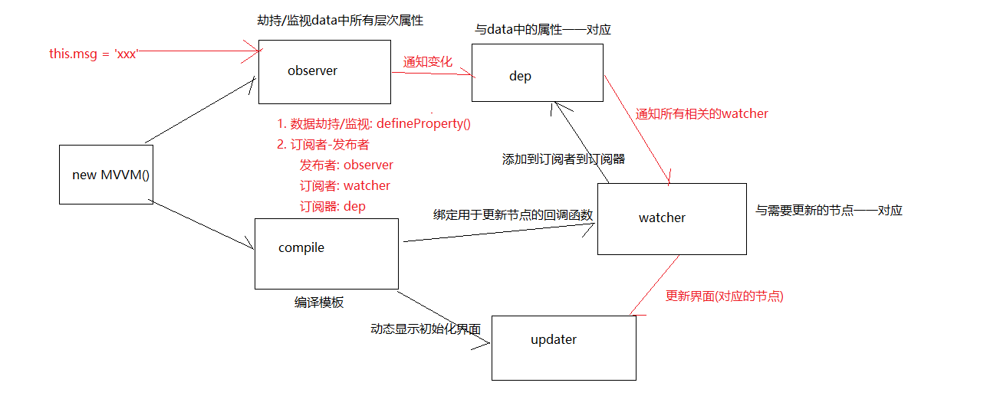

# Vue源码分析-面试总结

## 1. 数据代理

### 1) 理解
- 是什么? 通过vm直接操作vm内部的data的属性数据, 举例: this._data.msg  ===> this.msg
- 作用: 简化编码(少写了一层)

### 2) 原理
- 通过defineProperty()给vm添加与data所有属性对应的属性
- 给属性指定getter与setter
- 在getter方法中, 读取data中msg属性值返回   ==> 当this.msg时自动调用
- 在setter方法中, 将最新msg值赋值给data的msg属性  ==> 当this.msg = 'xxx'时自动调用

## 2. 模板解析

### 1. 前置说明

- 当前的实现没有使用虚拟DOM, 与vue的实现差别比较大
- 如果你直接跟面试官说这套实现, 对他冲击不大
- 后面我们会发布一套vue虚拟DOM的视频教程 ===> 学一学

### 2. 需要理解的点

- 模板解析只发生初始化显示阶段, 解析完后, 模板代码没有了
- 也就是说研究模板解析, 研究是如何实现初始化显示
- 解析2种模板语法  
  - 插值语法: 操作文本节点: textNode.textContent = 动态值    正则匹配
  - 指令语法: 操作元素节点
    - 事件指令: 给元素绑定指定事件名和回调的DOM事件监听: element.addEventListener(type, callback.bind(vm))
    - 非事件指令
      - v-text: element.innerText = 动态值
      - v-html: element.innerHTML = 动态值
      - v-bind:class: element.className = 动态值+静态class
- 解析每个模板语法(事件指令除外), 都会创建一个对应的watcher对象, 用于将来更新对应的节点

## 3. 响应式/数据绑定

### 1) 相关理解

- 响应式与数据绑定是同一个
- 何为响应式: 一旦更新data中的数据, 界面对应的节点就会自动更新

### 2) 原理

- 要搞清楚2个问题
  - 如何知道data中的属性数据变化了?
  - 当前数据变化需要更新哪几个节点?
- 使用2个技术
  - 数据劫持/监视: 使用defineProperty给data中所有层次属性都添加getter/setter, 一旦data中的数据改了, setter就会自动调用, 准备去更新界面
  - 订阅者-发布者: 通过订阅器(dep)通知所有相关的订阅者(watcher)去更新相应的节点
- 画响应式结构图(边画边说)

## 4. 数据双向绑定

### 1) 相关理解

- 以input中使用v-model来说: <input v-model="msg"/>
- 从data到页面的绑定:  输入框是根据data中的msg做初始化显示和更新显示
- 从页面到data绑定: 当输入发生改变时, 会自动的将输入的最新值自动保存到data的msg上

### 2) 原理

- 从data到页面的绑定: 内部给input指定了动态value为msg的值, 因为有单向数据绑定的存在, 一旦更新msg, 输入框就会自动 更新显示
- 从页面到data绑定:内部给input绑定了input事件监听, 在回调函数中读取input最新的value值保存到data的msg属性上

